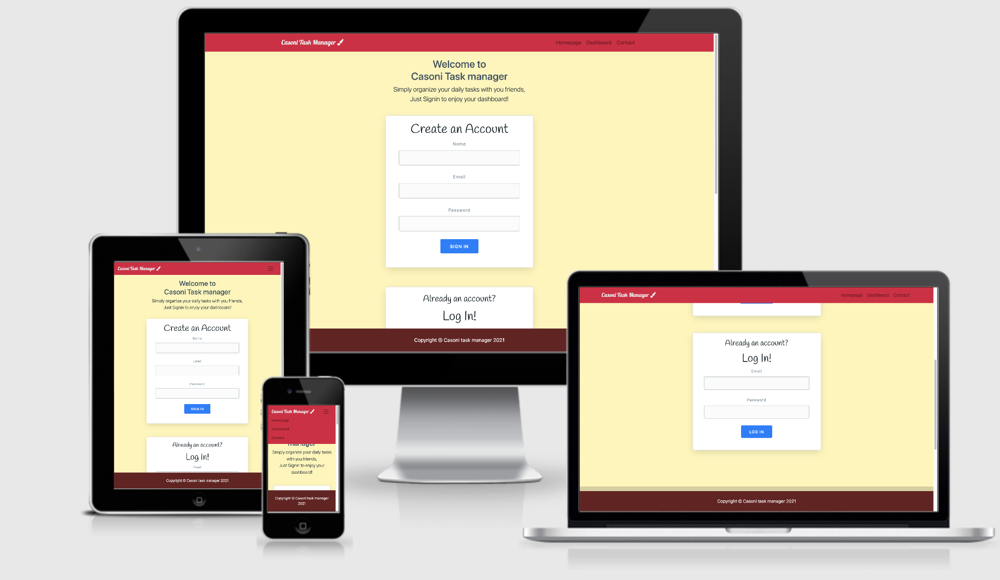
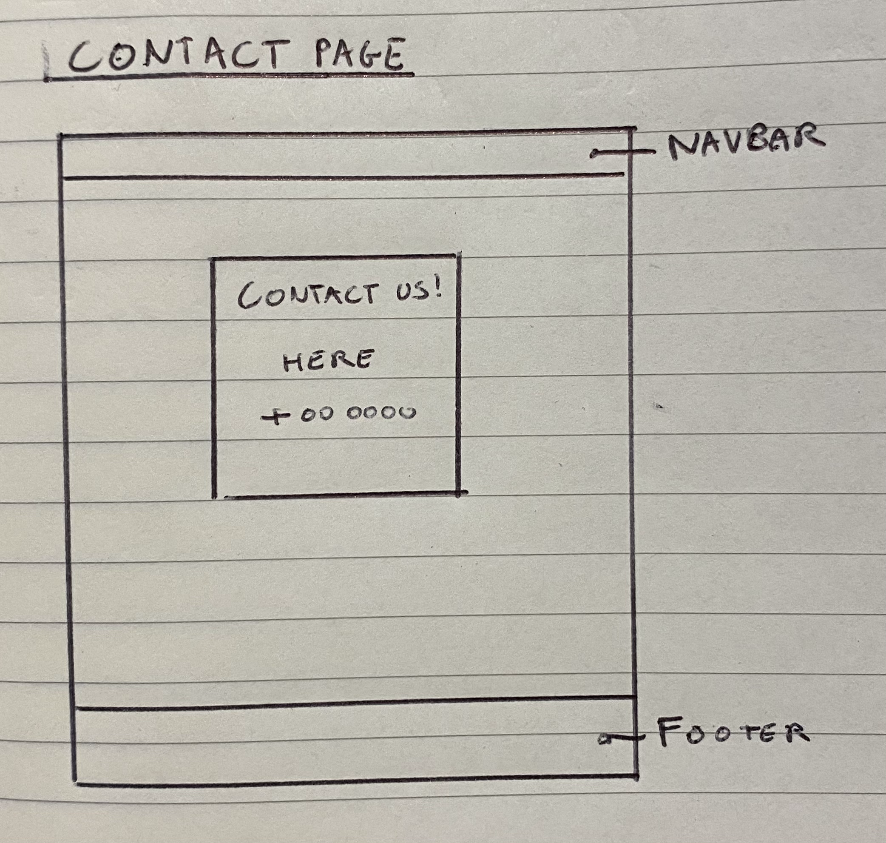

# ms3-casoni


# Casoni Task manager



With this README file, I'll guide you through my MS3 project for the DUBLIN CODE INSTITUTE.
If looking at my commits' time, you are wondering if multiple people were working on this project, then the answer is no; I just didn't sleep at all.
However, this is not a complaint. I simply would like to show you my passion for studying coding (even in these terrible times, where is very hard to find your motivation).

Casoni task manager is an application that allows users to create and share a task with their friends, like a basic social application.

It has been deployed to heroku and can be viewed [here](https://casoni-app.herokuapp.com/).

- Casoni Task manager MS3 Project
  - [UX](#ux)
    - [Project Goal](#project-goal)
    - [User Stories](#user-stories)
    - [Wireframes](#wireframes)
    - [Data Structure](#data-structure)
    - [Design](#design)
      - [Typography](#typography)
      - [Color Scheme](#color-scheme)
  - [Features](#features)
    - [Actual Features](#actual-features)
    - [User account](#user-account)
    - [User Session](#user-session)
    - [Security](#Security)
    - [Contact page](#contact-page)
    - [User Session](#user-session)
    - [404 page](#404-page)
  - [Future features](#future-features)
  - [Technologies Used](#technologies-used)
  - [Tools Used](#tools-used)
  - [Testing](#testing)
  - [Deployment](#deployment)
    - [Local Deployment](#local-deployment)
    - [Deployment to Heroku](#deployment-to-heroku)
  - [Credits](#credits)
    - [Media](#media)
    - [Acknowledgements](#acknowledgements)

    ---

## UX

### Project Goal

The user's experience was at the center during the development of this project.
One of the goals of the project was to create an application that is intuitive and easy to use.

### User Stories

-   As a user, I want to be able to create a task that everyone can see
-   As a user, I want to be able to mark a task once it's completed
-   As a user, I want to be able to erase all the completed tasks easily
-   As a user, I want to be able to erase all the tasks when a project is finished
-   As a user, I want to see a contact page in case of any help needed
-   As a user, I want to be able to sign out removing login session

### Wireframes

As always, here some old-style wireframes (in order: homepage, dashboard, contact)

#### homepage

#### dashboard

#### contact


### Data structure

Along with the user stories, the database collections has been delineated.
Specifically, in three main collections, using MongoDB as a non relational database:

- #### details collection

I used this collection to test my database in the first instance (specifically,
I displayed some generic info on the home page right after having connected my
[MongoDB](https://account.mongodb.com/account/login) cluster, and database).

- #### users collection

This collection has been created to store all the unique users
(comprehensive of name, email, and encrypted password) that are registered
in the application.

_id: "id converted in a str of 32 characters (letters + numbers)" <br>
name: "user user" <br>
email:"generic@gmail[.]com" <br>
password: "encrypted password..." <br>

- #### tasks collection

The tasks collection, or our dynamic collection, let us register every user's
task through the tasks dashboard. Within the information sent
 to the database collection, a user can also manipulate the task's status,
 marking them as completed.

_id :"id converted in a str of 32 characters (letters + numbers)" <br>
new_task: "football match at 8!" <br>
complete_status: true (or false) <br>

### Design

The application was built using bootstrap and its responsive grid system.
The [Start Bootstrap scrolling-nav
template](https://startbootstrap.com/template/scrolling-nav) was used for
the main structure of the site, and its default styling was overridden by a [style.css](static/css/style.css) file.

Fonts and colors were carefully chosen to give the application a joyful and welcoming look.

#### Color scheme

Main colors used are:

- #ffe93a6b
- #DD133F
- #692020


#### Typography

Fonts "Lobster" and "Kaushan", combined with the classic bootstrap font, were used
throughout the project to help the overall design looking user-friendly. 

## Features

### Actual features

#### User account

1. Every new user can create an account to access the dashboard,
using the "Sign up" form on the homepage. Once created a new account,
the user is automatically redirected to the dashboard.
2. If a user tries to create an account using an existing email, an automatic
message will display "This email address is already in use"
3. If a user tries to login account using an existing email,
an automatic message will display: "Your Login credentials are invalid".
4. If a user tries to go directly to the dashboard (even via URL),
he/she will be redirected to the homepage.

#### Dashboard

1. Use the dashboard on the dashboard page to add a new task,
and it will be visible to all your friends! Just type the task you like to add and press the "Add" button.
2. if one of the users wants to erase a task,
the only thing he/she has to do is click on it. 
3. On the contrary, if one of the users wants to remove a completed task
from the tasks list, he/she can use the "Remove completed" button.
4. A user can always remove all the tasks (completed or not) by clicking the
"Remove all" button directly.
5. To sign out completely, just use the "Sign out" button (below the dashboard). It will
redirect you to the homepage, cancelling your current session. 

#### Security

Every password used to signup is encrypted before being sent to the database.

#### Contact page

For more support, the user can click on the contact page to see the support phone number.

#### 404 page

Cannot find the right page? the 404 page will show you a link to help you go back to the homepage

## Technologies Used

-   HTML
-   CSS / Bootstrap
-   JavaScript / JQuery
-   AJAX
-   Python
-   Flask
-   Fontawesome
-   Fonts Google

## Tools Used

-   [GitHub](https://github.com/) for version control
-   [Heroku](https://heroku.com/) to deploy the application
-   [Chrome developer tools](https://developers.google.com/web/tools/chrome-devtools) to deploy the application

## Testing

Testing was done manually throughout the development process,
here the points that had to be tested and that I have tested:

- signup

- login

- routes

- toggle menu

- already existing email

- invalid credentials

- adding a task

- mark a task as complete

- deleting completed task

- deleting all task

- showing user id


All code was validated in the following ways:

**HTML** - All pages were successfully run through the [W3C HTML Validator](https://validator.w3.org/)
to ensure compliance with the standards set by the W3C, excluding the python code used within them.

**CSS** - The style.css file was successfully run through the the W3C's [Jigsaw Validator](https://jigsaw.w3.org/css-validator/).

**Python** - All Python code was checked with the [PEP8 online validator](http://pep8online.com/) and is PEP8 compliant.

## Deployment

Before deploying the application, ensure the following are installed:

-   [Python 3](https://www.python.org/)
-   [PIP](https://pypi.org/project/pip/)
-   [Heroku CLI](https://devcenter.heroku.com/articles/heroku-cli)

The application relies on the following service, and accounts will have to be created for it:

-   [MongoDB:](https://www.mongodb.com/)
    -    connecting MongoDB<br>Thanks to [TravelTimN](https://github.com/TravelTimN):
         -    [mongoSetup.md](https://github.com/Code-Institute-Solutions/MongoDB/blob/master/01-CreateAMongoDBDatabase/01-create_a_mongodb_database/mongoSetup.md)
-   [Heroku:](https://heroku.com/)
    <br><br>To deploy the application to Heroku, use the following steps:

    1. Login to your Heroku account and create a new app.

    2. Ensure the Procfile and requirements.txt files exist are present in your local repository.

        The Procfile should contain the following line:

        ```
        web: python app.py
        ```

        To ensure requirements.txt exists and is up to date, use the following line in your terminal:

        ```
        pip3 freeze --local > requirements.txt
        ```

    3. Connect heroku to your github repository using the "Deployment method", in the "Deploy" page of your heroku app:
        - https://dashboard.heroku.com/apps/%3Capp-name%3E/deploy/github 
        - Push the application automatically to heroku with Automatic deploys, alwasy in the "Deploy" section

    4. In your app in heroku, go to settings, reveal the config vars and enter the following variables:

        | Variable       | Value               |
        | -------------- | ------------------- |
        | IP             | 0.0.0.0             |
        | PORT           | 5000                |
        | MONGODB_NAME   | myFirstDB           |
        | MONGO_URI      | YOUR_MONGO_URI      |
        | SECRET_KEY     | YOUR_SECRET_KEY     |

    5. Go to the deploy tab of your application, and click "Deploy Branch" under the manual deploy section.

    6. The application is now deployed to heroku, and it can be accessed by clicking the "Open App" button on the top right.